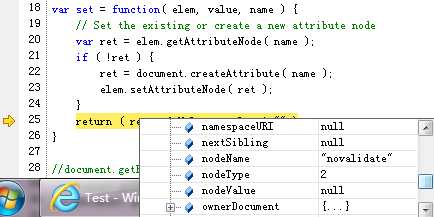
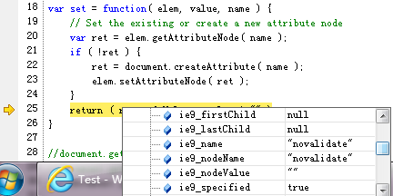

# 找不到成员。

----

| Language | Message                         |
|----------|---------------------------------|
| 简体中文 | 找不到成员。                    |
| 繁体中文 | 找不到成員。                    |
| 英文     | Member not found.               |
| 日文     | メンバーが見つかりません。      |
| 西班牙文 | No se ha encontrado el miembro. |

在 IE 浏览器中，有些对象并不总是存在的，使用定时器延时执行时可能 this 已经改变。

Firefox, Chrome 等浏览器无此问题。

```html
<button id="btn">button</button>
<script>
  btn.onclick = function(evt){
    var e = evt || window.event,
      type = e.type;

    alert(e);      // [object]
    alert(e.type); // "click"
    alert(e.asdf); // undefined.

    window.setTimeout(function(){
      alert(e);      // [object]
      alert(e.type); // throw new Error("找不到成员。");
      alert(e.asdf); // undefined.
      alert(type);   // "click".
    }, 1000);
  }
</script>
```

## 案例

jQuery 的 attr 方法，给表单元素设置 HTML5 属性部分时，IE10 兼容模式下会抛出这个异常。

这些属性包括：

* form[novalidate]
* input,textarea[placeholder]
* input,select,textarea,button,fieldset[autofocus]
* input[list]
* input,select,textarea,button,fieldset[required]
* input,button[formaction]
* input,button[formenctype]
* input,button[formmethod]
* input,button[formnovalidate]
* input,button[formtarget]
* input[pattern]
* *[aria-autocomplete]
* *[aria-atomic]
* *[aria-dropeffect]
* *[aria-grabbed]
* *[aria-haspopup]
* *[aria-label]
* *[aria-multiline]
* *[aria-orientation]
* *[aria-sort]
* *[aria-valuetext]

参考

* [aria-attributes](http://rawgithub.com/w3c/aria-in-html/master/index.html#definitions-of-states-and-properties-all-aria--attributes)
* [HTML5 Form Attributes](http://www.w3schools.com/html/html5_form_attributes.asp)
* [demo](../example/member-not-found-setAttribute.md)

```js
$("form").attr("novalidate", "novalidate");
$("input").attr("placeholder", "text");
```

jQuery 设置属性的方法如下：

```js
set : function( elem, value, name ) {
    // Set the existing or create a new attribute node
    var ret = elem.getAttributeNode( name );
    if ( !ret ) {
        ret = document.createAttribute( name );
        elem.setAttributeNode( ret );
    }
    return ( ret.nodeValue = value + "" );
}
```

其中运行到第 8 行，给 `ret.nodeValue` 设置值时抛出这个异常。


而实际调试可以看到，ret 是有 `nodeValue` 属性的，值为 `null`。



另外还有 `ie8_nodeValue` 和 `ie9_nodeValue` 属性。




另外这个 [issues](http://bugs.jquery.com/ticket/12577) 中提到设置 `input[aria-nocomplete]`
属性也会抛出这个异常，但是我在 IE8,9,10 及其兼容模式都没能重现。

### 解决方案：

使用 `setAttribute` 方法。

jQuery 说部分 IE6,7 中有部分属性无法使用 setAttribute 方法，目前已知表单项设置
`form` 属性时抛出 `发生意外。` 异常。

* input[form]
* select[form]
* label[form]
* textarea[form]
* button[form]
* option[form]
* optgroup[form]
* fieldset[form]

几乎不会有人会设置这个属性，本身是非法的。


## 相关异常


## 延伸阅读

* [【已解决】ZMM 斑主　为什么提示找不到成员呢？](http://bbs.51js.com/thread-57551-1-1.html)
* [setTimeout函数中event.type出错,提示找不到成员?](http://topic.csdn.net/u/20110117/11/8921bdc1-21a1-4c33-8d0e-b2ff578edb61.html)
